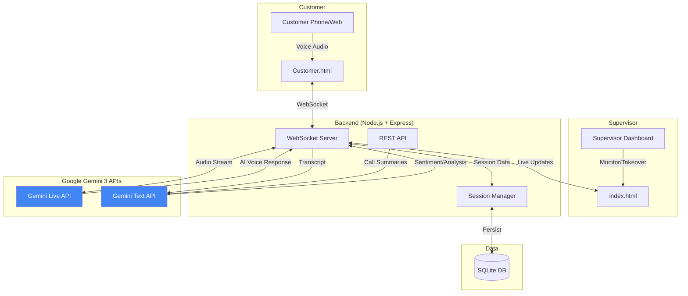
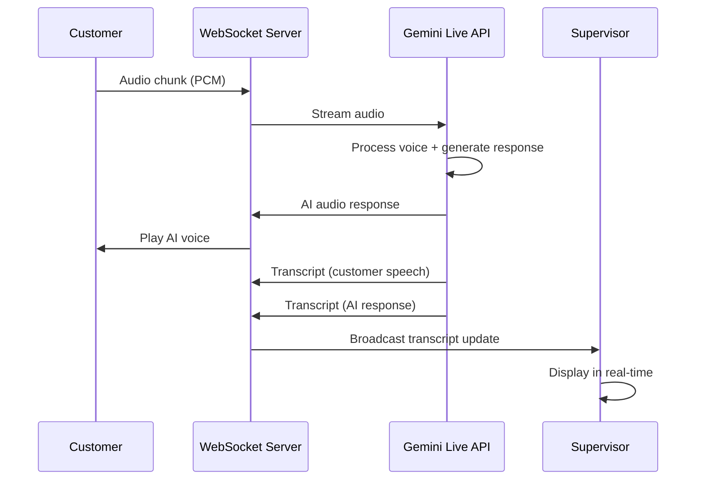
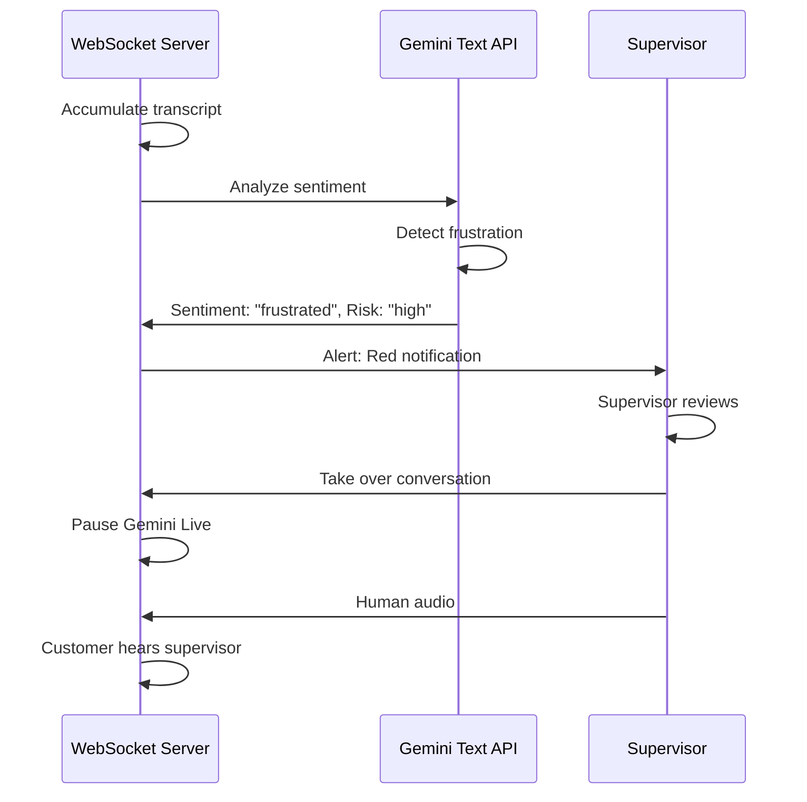
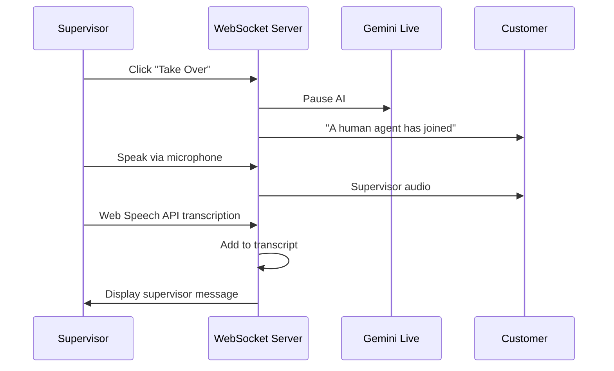

# 🏗️ Architecture Overview

## Live Support Co-Pilot - System Architecture

This document explains the technical architecture of the Live Support Co-Pilot, with a focus on how **Google Gemini 3 APIs** are integrated to power the intelligent voice assistant.

---

## 🎯 System Overview

Live Support Co-Pilot is a **real-time AI voice assistant** with live supervisor oversight. It combines:

- **Gemini Live API** for natural voice conversations
- **Gemini Text API** for sentiment analysis and summarization
- **WebSocket architecture** for real-time bidirectional communication
- **Human-AI handoff system** for seamless supervisor takeover

---

## 🧠 Gemini 3 Integration (Core Innovation)

### 1. Gemini Live API (Real-Time Voice)

**Purpose:** Powers natural, low-latency voice conversations between customers and the AI agent.

**Key Features Used:**

- **Streaming Audio I/O:** Bidirectional audio streaming with <1s latency
- **Real-time transcription:** Automatic speech-to-text for both AI and customer
- **Voice synthesis:** Natural-sounding AI responses
- **Context injection:** Supervisor can inject context mid-conversation during handback

**Implementation:** [`apps/api/gemini-live.js`](apps/api/gemini-live.js)

```javascript
// WebSocket connection to Gemini Live API
const ws = new WebSocket(
  `wss://generativelanguage.googleapis.com/ws/google.ai.generativelanguage.v1alpha.GenerativeService.BidiGenerateContent`,
);

// Stream customer audio to Gemini
this.ws.send(
  JSON.stringify({
    client_content: {
      turns: [
        { role: "user", parts: [{ inline_data: { data: audioBase64 } }] },
      ],
    },
  }),
);

// Receive AI voice response
ws.on("message", (data) => {
  const response = JSON.parse(data);
  if (response.serverContent?.modelTurn?.parts?.[0]?.inlineData) {
    // Play AI audio to customer
    const aiAudio = response.serverContent.modelTurn.parts[0].inlineData.data;
  }
});
```

**Why Gemini Live:**
Traditional speech-to-text → LLM → text-to-speech pipelines introduce 3-5 second delays. Gemini Live's streaming architecture achieves sub-second latency, enabling natural conversation flow.

---

### 2. Gemini Text API (Sentiment Analysis)

**Purpose:** Real-time analysis of conversation sentiment to detect frustration and trigger supervisor alerts.

**Key Features Used:**

- **Sentiment classification:** Positive, neutral, negative, frustrated
- **Sentiment scoring:** 0-100 scale for granular tracking
- **Intent detection:** Complaint, inquiry, support, purchase, etc.
- **Escalation risk assessment:** Low, medium, high

**Implementation:** [`apps/api/gemini-text.js`](apps/api/gemini-text.js#L30-L123)

```javascript
async analyzeConversation(transcript) {
  const prompt = `Analyze this customer service conversation and respond in JSON:
  CONVERSATION:
  ${transcript.map(m => `${m.role}: ${m.content}`).join('\n')}

  Respond with ONLY this JSON structure:
  {
    "sentiment": "positive" | "neutral" | "negative" | "frustrated",
    "sentimentScore": 0-100,
    "intent": "complaint" | "inquiry" | "support" | "purchase" | "cancellation",
    "keyIssues": ["issue1", "issue2"],
    "escalationRisk": "low" | "medium" | "high"
  }`;

  const result = await this.model.generateContent(prompt);
  return JSON.parse(result.response.text());
}
```

**Trigger Logic:**

- Frustration detected → Red alert in supervisor dashboard
- High escalation risk → Supervisor notification

---

### 3. Gemini Text API (Call Summarization)

**Purpose:** Generate post-call summaries with key issues, resolutions, and action items.

**Key Features Used:**

- **Structured summarization:** Extracts key information in JSON format
- **Action item extraction:** Identifies follow-up tasks
- **Sentiment summary:** Overall call sentiment and trends

**Implementation:** [`apps/api/gemini-text.js`](apps/api/gemini-text.js#L168-L235)

```javascript
async generateSummary(transcript) {
  const prompt = `Generate a call summary:
  {
    "summary": "One paragraph summary",
    "keyIssues": ["issue1", "issue2"],
    "resolution": "How it was resolved",
    "sentiment": "overall sentiment",
    "actionItems": ["action1", "action2"]
  }`;

  const result = await this.model.generateContent(prompt);
  return JSON.parse(result.response.text());
}
```

---

## 📊 System Architecture Diagram



---

## 🔄 Data Flow

### Flow 1: AI Voice Conversation



### Flow 2: Sentiment Analysis & Escalation



### Flow 3: Human Takeover



---

## 🏗️ Technical Components

### Backend Components

| Component               | File                                                                   | Purpose                                                            |
| ----------------------- | ---------------------------------------------------------------------- | ------------------------------------------------------------------ |
| **WebSocket Server**    | [`apps/api/index.js`](apps/api/index.js)                               | Manages real-time connections for customer, supervisor, and Gemini |
| **Gemini Live Session** | [`apps/api/gemini-live.js`](apps/api/gemini-live.js)                   | Handles Gemini Live API WebSocket connection and audio streaming   |
| **Gemini Text Client**  | [`apps/api/gemini-text.js`](apps/api/gemini-text.js)                   | Sentiment analysis and summarization using Gemini Text API         |
| **Session Manager**     | [`apps/api/conversation-manager.js`](apps/api/conversation-manager.js) | Manages active sessions, transcripts, and mode (AI/human)          |
| **Database**            | [`apps/api/database-manager.js`](apps/api/database-manager.js)         | Persists call summaries and session data to SQLite                 |

### Frontend Components

| Component                | File                                                 | Purpose                                               |
| ------------------------ | ---------------------------------------------------- | ----------------------------------------------------- |
| **Supervisor Dashboard** | [`apps/web/index.html`](apps/web/index.html)         | 3-pane dashboard for monitoring sessions and takeover |
| **Customer Interface**   | [`apps/web/customer.html`](apps/web/customer.html)   | Phone-style UI for customer calls                     |
| **Call Summaries**       | [`apps/web/summaries.html`](apps/web/summaries.html) | Post-call analytics and summaries                     |

---

## 🔐 Security & Error Handling

### API Key Management

- Gemini API key stored in `.env` file
- Never exposed to frontend
- Validated on server startup

### WebSocket Authentication

- Session-based authentication
- Role-based access (customer vs supervisor)
- Automatic reconnection on disconnect

### Error Scenarios Handled

| Error                 | Handling                                           |
| --------------------- | -------------------------------------------------- |
| Gemini API timeout    | Graceful fallback with error message to supervisor |
| WebSocket disconnect  | Auto-reconnect with exponential backoff            |
| Audio stream failure  | Switch to text-only mode                           |
| Sentiment API failure | Keyword-based fallback intent detection            |

**Example:** Fallback Intent Detection ([`gemini-text.js:125-160`](apps/api/gemini-text.js#L125-L160))

```javascript
detectIntentFromKeywords(text) {
  const intentPatterns = [
    { intent: "complaint", keywords: ["terrible", "worst", "disappointed"] },
    { intent: "support", keywords: ["help", "issue", "problem", "not working"] },
    // ... more patterns
  ];

  for (const pattern of intentPatterns) {
    if (pattern.keywords.some(keyword => text.toLowerCase().includes(keyword))) {
      return pattern.intent;
    }
  }
  return "inquiry"; // Default if no match
}
```

---

## 🚀 Performance Optimizations

### 1.- **Echo Detection (Gemini Live)**:

- Stores last 10s of AI audio output.
- Fuzzy-matches incoming user audio against AI output.
- Prevents AI form hearing itself (crucial for speakerphone usage). ([`gemini-live.js:108-111`](apps/api/gemini-live.js#L108-L111))

- **Context Injection (Supervisor Override)**:
  - Supervisor sends `context_injection` message via WebSocket.
  - Backend creates a specialized user message: `[SYSTEM_INSTRUCTION] <context>`
  - This is injected into the conversation stream invisibly to the customer.
  - Gemini adapts its next response based on this injected context.

### 2. **Fuzzy Deduplication**

- **Problem:** Web Speech API and Gemini transcription create duplicate messages
- **Solution:** 60% word overlap detection instead of exact match ([`index.js:300-325`](apps/api/index.js#L300-325))

### 3. **Audio Buffering**

- **Problem:** Network jitter causes choppy audio
- **Solution:** Client-side audio buffering with smooth playback

---

## 🎯 Key Technical Achievements

1. **Sub-second Voice Latency**
   - Gemini Live API + WebSocket = <1s round trip
   - Natural conversation flow

2. **Real-time Multimodal Analysis**
   - Simultaneous voice streaming + sentiment analysis
   - Live supervisor updates without blocking conversation

3. **Seamless Human-AI Handoff**
   - Zero-latency takeover
   - Context preservation across modes
   - Supervisor speech transcription using Web Speech API

4. **Production-Ready Error Handling**
   - Graceful degradation
   - Automatic fallbacks
   - User-friendly error messages

---

## 📈 Scalability Considerations

- **Horizontal Scaling:** WebSocket server can be load-balanced
- **Session Persistence:** SQLite can be replaced with PostgreSQL/MongoDB
- **CDN:** Static assets can be served via CDN
- **Gemini API Rate Limits:** Handled with queuing and retry logic

---

## 🛠️ Technology Stack

| Layer         | Technologies                                     |
| ------------- | ------------------------------------------------ |
| **AI**        | Google Gemini 3 (Live API, Text API)             |
| **Backend**   | Node.js 18+, Express.js, WebSocket (ws)          |
| **Frontend**  | Vanilla JavaScript, Modern CSS (Glassmorphism)   |
| **Database**  | SQLite (production: PostgreSQL recommended)      |
| **Audio**     | Web Audio API, MediaRecorder API, Web Speech API |
| **Real-time** | WebSocket bidirectional communication            |

---

## 📚 Additional Resources

- [Gemini Live API Documentation](https://ai.google.dev/gemini-api/docs/live?example=mic-stream)
- [Gemini Text API Documentation](https://ai.google.dev/api/generate-content)
- [WebSocket Protocol RFC 6455](https://datatracker.ietf.org/doc/html/rfc6455)
- [Web Audio API Spec](https://www.w3.org/TR/webaudio/)

---

**For hackathon judges:** This architecture demonstrates advanced integration of Gemini 3's cutting-edge APIs to solve a real-world problem. The system combines AI speed with human empathy, creating a scalable solution for modern customer service.
